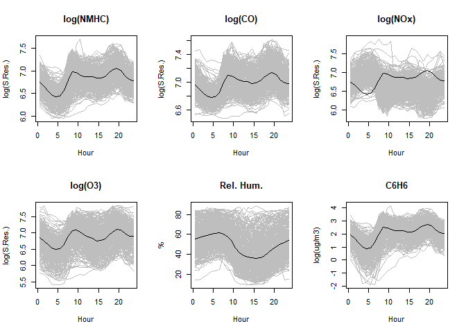

# Supplementary material for Functional Regression Models with Functional Response (FRMFR)

Supplementary codes and data used in the paper.

Please cite:

> **Febrero-Bande, M., Oviedo-de la Fuente, M., Darbalaei, M., & Amini,
> M. (2024).**  
> *Functional regression models with functional response: a new approach
> and a comparative study.*  
> Comput Stat 40, 2701–2727 (2025).
> <https://doi.org/10.1007/s00180-024-01572-4>

``` bibtex
@article{febrero2025functional,
  title={Functional regression models with functional response: a new approach and a comparative study: M. Febrero--Bande et al.},
  author={Febrero--Bande, Manuel and Oviedo-de la Fuente, Manuel and Darbalaei, Mohammad and Amini, Morteza},
  journal={Computational Statistics},
  volume={40},
  number={5},
  pages={2701--2727},
  year={2025},
  publisher={Springer}
}
```

## Installation

To run the implementations used in the paper (numerical studies and
real-data examples) install:

### 1) `fda.frm` (FRM methods) + dependency `fda.usc`

`fda.frm` **depends on** `fda.usc` and contains the FRM methods
(linear/semiparametric/kernel with **functional response**):

- `fregre.mlm.fr` (FLMFR)
- `fregre.sam.fr` (FSAMFR)
- `fregre.kam.fr` (FKAMFR)

``` r
# install.packages("devtools")
devtools::install_github("moviedo5/fda.frm")

# Core dependency for functional data objects/utilities:
install.packages("fda.usc")
```

> **Note.** The package **fda.usc.devel** used to bundle `fda.usc` plus
> modifications and new functions.  
> Now, for function-on-function models with functional response, use
> **fda.frm** (which builds on `fda.usc`).

<!--
&#10;``` r
packageurl <- "https://github.com/moviedo5/FRMFR/blob/main/pkg/fda.usc.devel_2.1.1.tar.gz"
install.packages(packageurl, repos=NULL)
url <- "https://github.com/rubenfcasal/simres/releases/download/v0.1/simres_0.1.3.zip"
install.packages(url, repos = NULL)
```
&#10;
To compares our proposed methods (namely, FLMFR, FSAMFR, and FKAMFR), with the four mentioned competitor methods (namely, PFR, FAMM, LSC, and DISC).
-->

## 2. `refund` package

PFR and FAMM methods are available in the `refund` package through the
command `pffr`, where the argument formula allows us to include linear
`ffpc`, `ff` or nonlinear term `sff`.

To install refund package from CRAN or Github.

``` r
# install.packages("refund")
# install_version("refund", version = "0.1-30", 
#                 repos = "http://cran.us.r-project.org")
# latest patched version directly from Github
devtools::install_github("refunders/refund") 
```

## 3. `FRegSigCom` package

The authors considered the latter as an experimental feature. LSC and
DISC methods are available in the `FRegSigCom` package through the
commands `cv.sigcom` and `cv.nonlinear`.

This package is not currently maintained and its latest version was
published in November 2018 but, anyway, it can be downloaded and
installed from the Packages/Archive section of CRAN.

``` r
devtools::install_github("moviedo5/FRMFR/pkg/FRegSigCom")
# url <- "https://cran.r-project.org/src/contrib/Archive/FRegSigCom/FRegSigCom_0.3.0.tar.gz"
# install.packages(url, repos=NULL, type="source")
```

# Simulation (Numerical Studies)

<!--Consult a detailed documentation of the code and examples of use in-->

- `./inst/script/Simulation.R`: Code for main simulation. Scenarios 1–4.

  - Linear smooth (LS)
  - Linear non-smooth (LNS)
  - Nonlinear smooth (NLS)
  - Nonlinear non-smooth (NLNS)

``` r
library(fda.frm)
library(fda.usc)
# source("./inst/script/Simulation.R")
```

# Real Data Applications

See `RealDataApplications/` for the data examples and runnable R
scripts.

## 1. Air Quality Data

The Air Quality dataset (AQI) from the UCI repository (Qi and Luo 2019).
AQI is a popular dataset consisting of five metal oxide chemical sensors
embedded into an air quality multisensor device. The column names in the
dataset begin with *PT*. The sensors are labeled with:

- `C6H6`: (log) Benzene concentrations (in microg/m^3),
- `CO`: (log) Carbon monoxide (in mg/m^3),
- `NMHC`: (log) Non-methane hydrocarbons (in ppm),
- `NOx`: (log) total nitrogen Oxides (in mg/m^3),
- `NO2`: (log) total nitrogen dioxides (in microg/m^3),
- \`O3\`\`: ozone (in microg/m^3).
- `Temp`: temperature (in Celsius).
- \`rH\`\`: humidity (in percentage).

because it is supposed that its measures are related with the respective
pollutants.

``` r
data("AirQuality")
```

The corresponding plots are displayed in Figure 16 of paper.

<!-- -->

The goal of this study is to predict the content of Benzene (`C6H6`)
obtained through an independent analyzer considered the Ground Truth.
These sensors were collected as 24 hourly averaged concentration values
each day jointly with the relative humidity (`rH`) as an external
factor.

- `/RealDataApplications/AirQuality.R`: Code for Bike–sharing data
  example (high computational time)

``` r
source("/RealDataApplications/AirQuality.R")
```

<!--+ AirQualityUCI.xlsx: Air Quality Data.-->

## 2. Bike-sharing Data

To illustrate how our proposed function-on-function methods work, we use
the Bike-sharing data (Fanaee-T and Gama 2014). This dataset is
collected by [Capital Bikeshare System (CBS), Washington D.C.,
USA](https://ride.capitalbikeshare.com/system-data). The number of
casual bike rentals (`NCBR`) is considered as our functional response
variable and four functional predictors:

- `T`: Temperature (in Celsius),
- `H`: Humidity (in percentage).
- `WS`: Wind Speed (normalized)
- `FT`: Feeling Temperature (normalized)

``` r
data("BikeSharing")
names(BikeSharing)
# [1] "df" "logNBCR" "temp" "feeltemp" "humidity" "windspeed"
```

The corresponding plots are displayed in Figure.

    ## [1] "df"        "logNBCR"   "temp"      "feeltemp"  "humidity"  "windspeed"

<!-- -->

These variables are recorded each hour from January 1, 2011, to December
31, 2012. Similar to Kim et al. (2018), we only consider the data for
Saturday trajectories, and `NBCR` is log–transformed to avoid its
natural heteroskedasticity. Ignoring three curves with missing values,
the dataset contains 102 trajectories, each with 24 data points (hourly)
for all variables.

- `/RealDataApplications/BikeSharing.R`: Code for example Air Quality

``` r
source("/RealDataApplications/BikeSharing.R")
```

<!--+ bike-sharing2.R: Code for Bike--sharing data example.
+ hour.csv: Bike--sharing data.-
-->

## 3. Electricity Demand and Price Data

Daily profiles of Electricity Price and Demand, both measured hourly,
are obtained from two biannual periods separated by ten years: 2008-2009
and 2018-2019 (source:omie.es).

- `/RealDataApplications/omie2008vs2018.R`: Code for Electricity Demand
  and Price example.

``` r
data(omel2008_09)
names(omel2008_09)
# [1] "df" "Pr" "En"
data(omel2018_19)
names(omel2008_19)
# [1] "df" "Pr" "En"
```

The corresponding plots are displayed in Figure.

<!-- -->

Profiles for Electricity Demand (first row) and Electricity Price
(second row) for the periods 2008-09 (first column) and 2018-19 (second
column). The black line corresponds to the functional mean of each
dataset.

- `/RealDataApplications/omie2008vs2018.R`: Code for Electricity Demand
  and Price example.

``` r
source("/RealDataApplications/Exampleomel.R")
```

<!--
+ Exampleomel.R: Code for Electricity Demand and Price example.
&#10;+ omel2008-09.rda: Electricity data for 2008-09 period.
&#10;+ omel2018-19.rda: Electricity data for 2018-19 period.
&#10;@darbalaei2022functional
&#10;-->

## References

<!--
- Fanaee-T, H., & Gama, J. (2014). Event labeling combining ensemble detectors and background knowledge. *Progress in Artificial Intelligence*, 2(2), 113–127.
&#10;
- Febrero–Bande, M., Oviedo-de la Fuente, M., Darbalaei, M., & Amini, M. (2025). Functional regression models with functional response: a new approach and a comparative study: M. Febrero–Bande et al. *Computational Statistics*, 40(5), 2701-2727. [DOI:10.1007/s00180-024-01572-4](https://doi.org/10.1007/s00180-024-01572-4)
&#10;- Kim, J. S., Staicu, A. M., Maity, A., Carroll, R. J., & Ruppert, D. (2018). Additive function-on-function regression. *Journal of Computational and Graphical Statistics*, 27(1), 234–244.
&#10;- Qi, X., & Luo, R. (2019). Nonlinear function-on-function additive model with multiple predictor curves. *Statistica Sinica*, 29(2), 719–739.
&#10;
-->

<div id="refs" class="references csl-bib-body hanging-indent"
entry-spacing="0">

<div id="ref-Fanaee-T2014" class="csl-entry">

Fanaee-T, Hadi, and Joao Gama. 2014. “Event Labeling Combining Ensemble
Detectors and Background Knowledge.” *Progress in Artificial
Intelligence* 2 (2): 113–27.

</div>

<div id="ref-Kim2018" class="csl-entry">

Kim, Janet S, Ana-Maria Staicu, Arnab Maity, Raymond J Carroll, and
David Ruppert. 2018. “Additive Function-on-Function Regression.”
*Journal of Computational and Graphical Statistics* 27 (1): 234–44.

</div>

<div id="ref-Qi2019" class="csl-entry">

Qi, Xin, and Ruiyan Luo. 2019. “Nonlinear Function-on-Function Additive
Model with Multiple Predictor Curves.” *Statistica Sinica* 29 (2):
719–39. <https://www.jstor.org/stable/26705485>.

</div>

</div>
