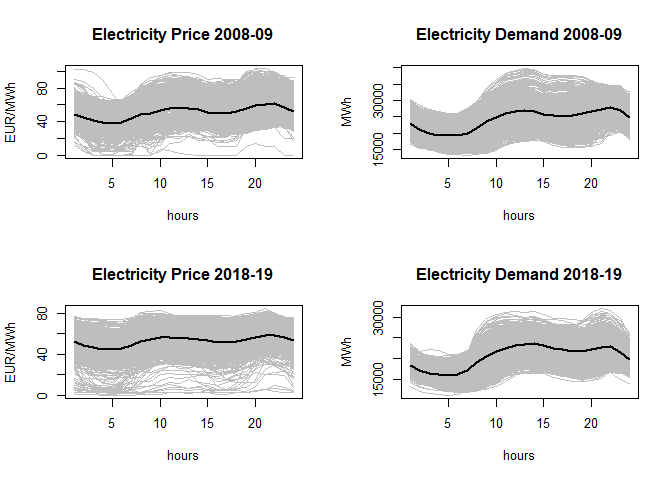

# Supplementary material for Functional Response Model with Functional Response (FRMFR)

Supplementary codes and data used in the paper Darbalaei et al. (2022).

Please cite this paper as:

    @article{darbalaei2022functional,
      title={Functional Regression Models with Functional Response: New Approaches and a Comparative Study},
      author={Darbalaei, Mohammad and Amini, Morteza and Febrero-Bande, Manuel and Oviedo de-la Fuente, Manuel},
      journal={arXiv preprint arXiv:2207.04773},
      year={2022}
    }

# Installation

In order to use paper implementation and run all files (numerical and
real examples), the following prerequisites are needed:

## 1. `fda.usc` package

To install `fda.usc.devel` package (devel version of `fda.usc`) from
Github with (2023/03/29):

``` r
# install.packages("devtools")
require(devtools)
devtools::install_github("moviedo5/FRMFR/pkg/fda.usc.devel")
```

To compares our proposed methods (namely, FLMFR, FSAMFR, and FKAMFR,
which are available in the `fda.usc` package (devel version) through the
commands `fregre.mlm.fr`, `fregre.sam.fr` and `fregre.kam.fr`) with the
four mentioned competitor methods (namely, PFR, FAMM, LSC, and DISC).

## 2. `refund` package

PFR and FAMM methods are available in the `refund` package through the
command `pffr`, where the argument formula allows us to include linear
`ffpc`, `ff` or nonlinear term `sff`.

To install refund package from CRAN or Github.

``` r
# install.packages("refund")
devtools::install_version("refund", version = "0.1-30", 
                          repos = "http://cran.us.r-project.org")
# latest patched version directly from Github
# devtools::install_github("refunders/refund") 
```

## 3. `FRegSigCom` package

The authors considered the latter as an experimental feature. LSC and
DISC methods are available in the `FRegSigCom` package through the
commands `cv.sigcom` and `cv.nonlinear`.

This package is not currently maintained and its latest version was
published in November 2018 but, anyway, it can be downloaded and
installed from the Packages/Archive section of CRAN.

``` r
devtools::install_github("moviedo5/FRMFR/pkg/FRegSigCom")
# url <- "https://cran.r-project.org/src/contrib/Archive/FRegSigCom/FRegSigCom_0.3.0.tar.gz"
# install.packages(url, repos=NULL, type="source")
```

# Simulation (Numerical Studies)

- `./inst/script/Simulation.R`: Code for main simulation. Scenarios 1–4.

  - Linear smooth (LS)
  - Linear non-smooth (LNS)
  - Nonlinear smooth (NLS)
  - Nonlinear non-smooth (NLNS)

``` r
library(fda.usc.devel)
# source("./inst/script/Simulation.R")
```

# Real Data Applications

Consult a detailed documentation of the data examples and R code of
used.

## 1. Air Quality Data

Our last example is the Air Quality dataset (AQI) available from the UCI
machine learning repository Qi and Luo (2019). AQI is a popular dataset
consisting of five metal oxide chemical sensors embedded into an air
quality multisensor device.
<!--The column names in the dataset begin with *PT*. --> The sensors are
labeled with:

- Carbon monoxide (`CO`),
- Non-methane hydrocarbons (`NMHC`),
- Total Nitrogen Oxides (`NOx`),
- Ozone (`O3`) because it is supposed that its measures are related with
  the respective pollutants.

``` r
data("AirQuality")
```

The corresponding plots are displayed in Figure 16 of paper.

<!-- -->

The goal of this study is to predict the content of (log transformation
of) Benzene (`C6H6`) obtained through an independent analyzer considered
the Ground Truth. These sensors were collected as 24 hourly averaged
concentration values each day jointly with the relative humidity (`rH`)
as an external factor.

- `/RealDataApplications/AirQuality.R`: Code for AirQuality data example
  (high computational time)

``` r
source("/RealDataApplications/AirQuality.R")
```

<!--+ AirQualityUCI.xlsx: Air Quality Data.-->

## 2. Bike-sharing Data

To illustrate how our proposed function-on-function methods work, we use
the Bike-sharing data (Fanaee-T and Gama 2014) as our first example.
This dataset is collected by [Capital Bikeshare System (CBS), Washington
D.C., USA](https://ride.capitalbikeshare.com/system-data). The logaritmo
of number of casual bike rentals (`NCBR`) is considered as our
functional response variable (`log(NCBR+1)`) and four functional
predictors:

- Temperature (`T`),
- Humidity (`H`),
- Wind Speed (`WS`) and
- Feeling Temperature (`FT`)

`data("BikeSharing")` included in `fda.usc.devel` packages:

``` r
data("BikeSharing")
```

The corresponding plots are displayed in Figure 5 of paper.

    ## [1] "df"        "logNBCR"   "temp"      "feeltemp"  "humidity"  "windspeed"

<!-- -->

These variables are recorded each hour from January 1, 2011, to December
31, 2012. Similar to Kim et al. (2018), we only consider the data for
Saturday trajectories, and `NBCR` is log–transformed to avoid its
natural heteroskedasticity. Ignoring three curves with missing values,
the dataset contains 102 trajectories, each with 24 data points (hourly)
for all variables.

- `/RealDataApplications/BikeSharing.R`: Code for example Air Quality

``` r
source("/RealDataApplications/BikeSharing.R")
```

<!--+ bike-sharing2.R: Code for Bike--sharing data example.
+ hour.csv: Bike--sharing data.-
-->

## 3. Electricity Demand and Price Data

Daily profiles of Electricity Price and Demand, both measured hourly,
are obtained from two biannual periods separated by ten years: 2008-2009
and 2018-2019 (source:omie.es).

- `/RealDataApplications/omie2008vs2018.R`: Code for Electricity Demand
  and Price example.

``` r
data(omel2008_09)
names(omel2008_09)
```

    ## [1] "df" "Pr" "En"

The corresponding plots are displayed in Figure 6 of paper.

<!-- -->

Profiles for Electricity Demand (first row) and Electricity Price
(second row) for the periods 2008-09 (first column) and 2018-19 (second
column). The black line corresponds to the functional mean of each
dataset.

- `/RealDataApplications/omie2008vs2018.R`: Code for Electricity Demand
  and Price example.

``` r
source("/RealDataApplications/omie2008vs2018.R")
```

## References

<div id="refs" class="references csl-bib-body hanging-indent">

<div id="ref-darbalaei2022functional" class="csl-entry">

Darbalaei, Mohammad, Morteza Amini, Manuel Febrero-Bande, and Manuel
Oviedo de-la Fuente. 2022. “Functional Regression Models with Functional
Response: New Approaches and a Comparative Study.” *arXiv Preprint
arXiv:2207.04773*. <https://doi.org/10.48550/arXiv.2207.04773>.

</div>

<div id="ref-Fanaee-T2014" class="csl-entry">

Fanaee-T, Hadi, and Joao Gama. 2014. “Event Labeling Combining Ensemble
Detectors and Background Knowledge.” *Progress in Artificial
Intelligence* 2 (2): 113–27.

</div>

<div id="ref-Kim2018" class="csl-entry">

Kim, Janet S, Ana-Maria Staicu, Arnab Maity, Raymond J Carroll, and
David Ruppert. 2018. “Additive Function-on-Function Regression.”
*Journal of Computational and Graphical Statistics* 27 (1): 234–44.

</div>

<div id="ref-Qi2019" class="csl-entry">

Qi, Xin, and Ruiyan Luo. 2019. “NONLINEAR FUNCTION-ON-FUNCTION ADDITIVE
MODEL WITH MULTIPLE PREDICTOR CURVES.” *Statistica Sinica* 29 (2):
719–39. <https://www.jstor.org/stable/26705485>.

</div>

</div>
